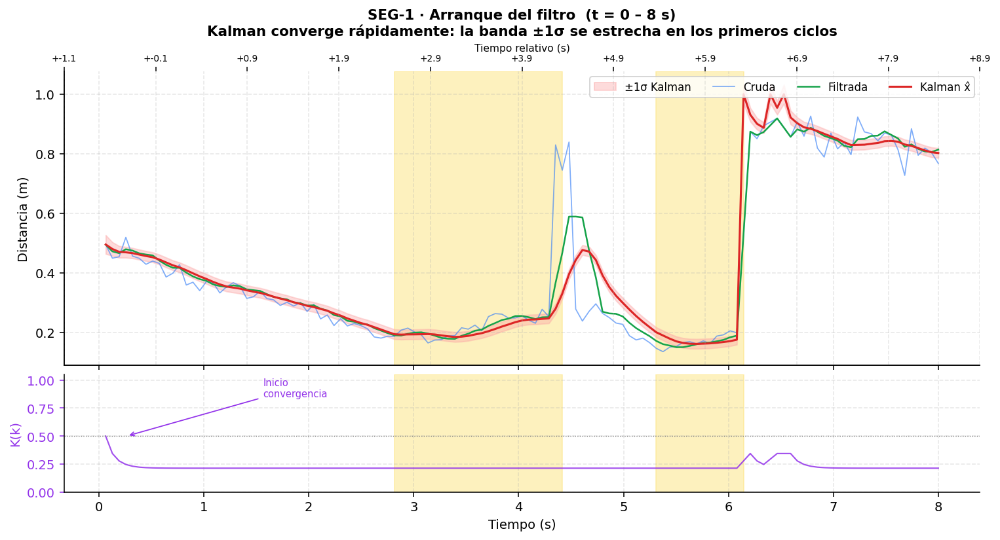
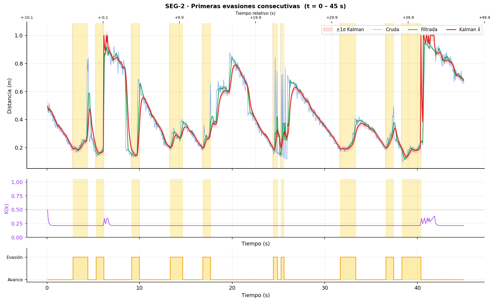
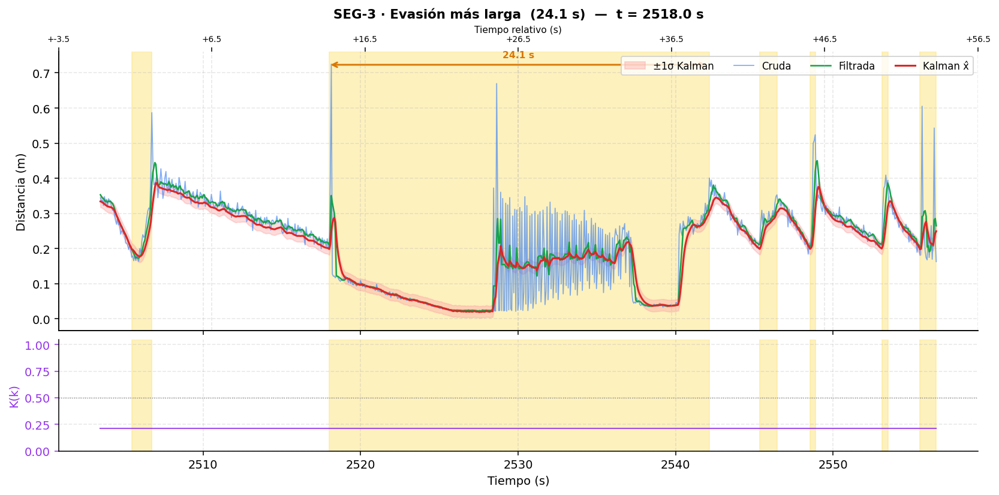
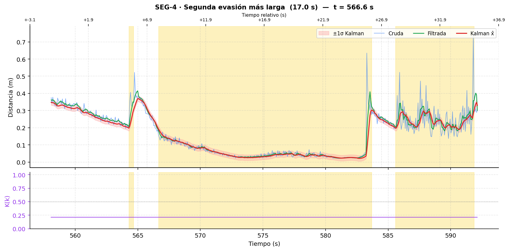
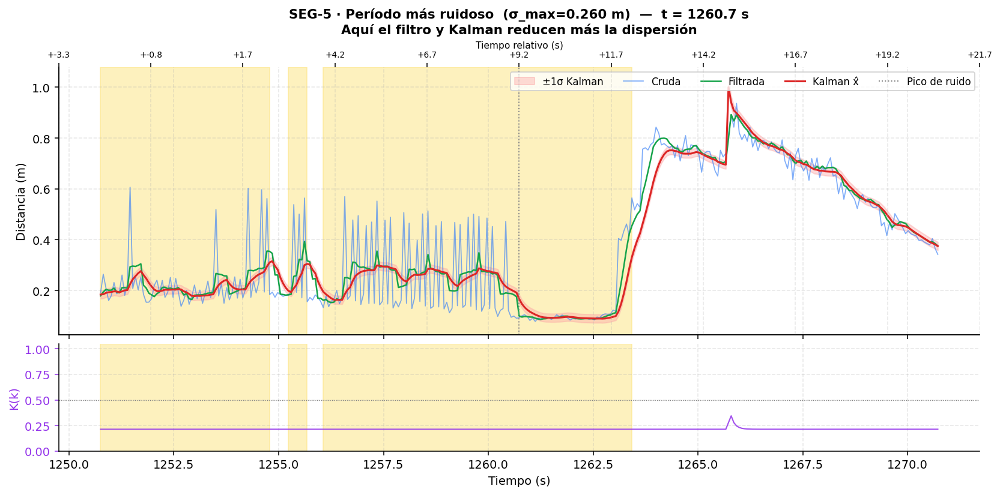
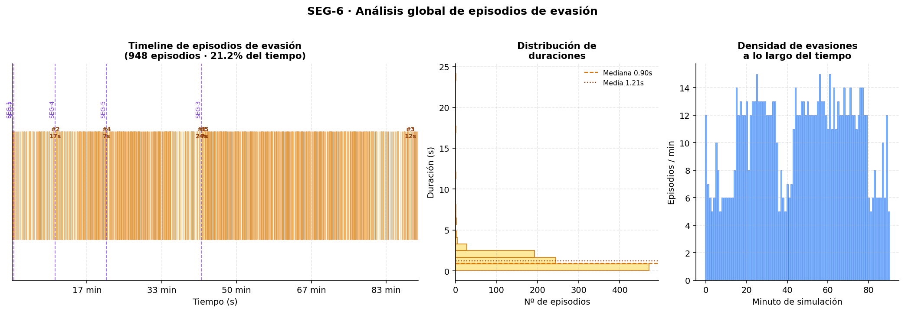
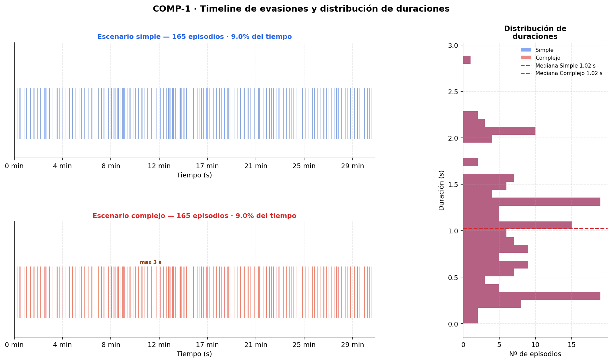
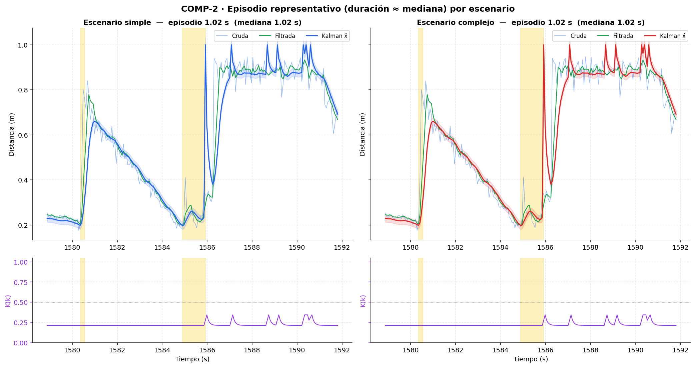
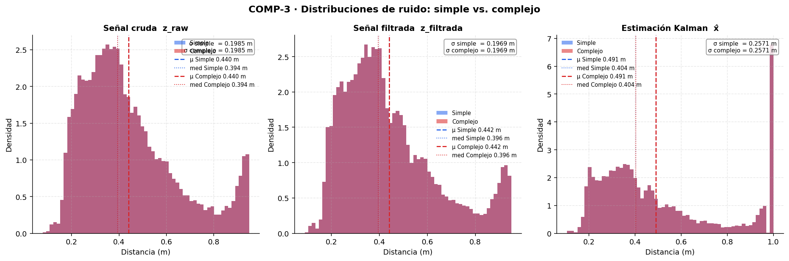
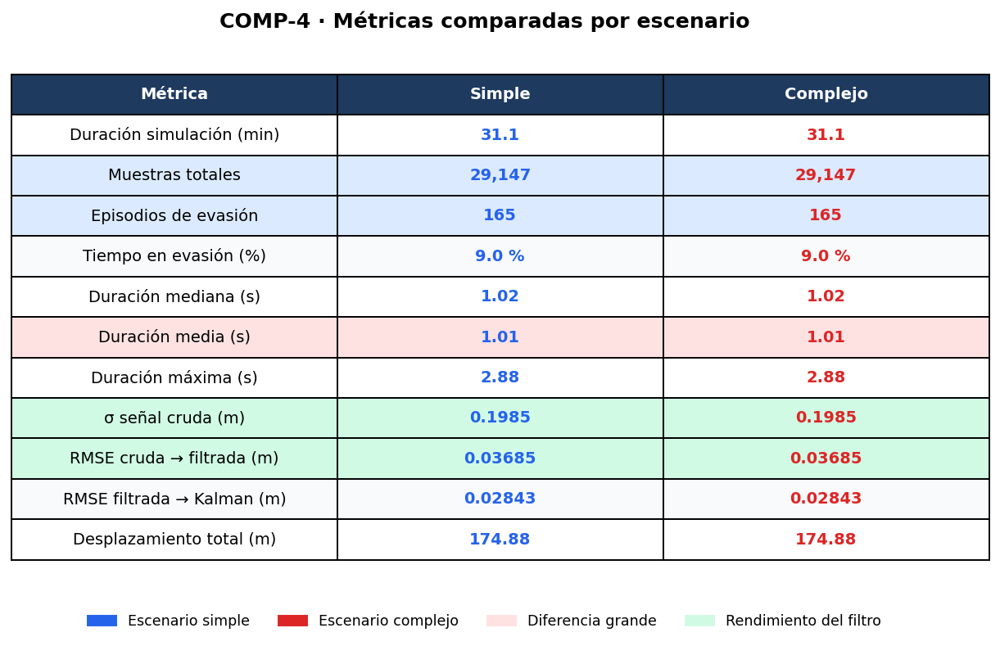

# **Laboratorio 2: Navegación reactiva con filtrado y fusión de sensores en Webots**

Asignatura: Robótica y Sistemas Autónomos (ICI 4150)
Integrantes: Nicolás Fuentes, Eva Ponce, Esteban Schanze, Juan Geraldo

## 1. **Objetivo**
Implementar un sistema de navegación reactiva para un robot móvil diferencial
en Webots, usando sensores de distancia y encoders de rueda, aplicando filtrado
sobre las mediciones y un filtro de Kalman para estimar la distancia frontal a
obstáculos.

## 2. **Robot y sensores utilizados**
Se utiliza el robot e-puck de Webots (robot diferencial con dos ruedas
motrices independientes). Dispositivos empleados:

- **Sensores de proximidad IR** (`ps0`–`ps7`): Los frontales son `ps0` y `ps7`;
  los diagonales `ps1` (derecho) y `ps6` (izquierdo); los laterales `ps2`
  (derecho) y `ps5` (izquierdo); los traseros `ps3` y `ps4`. El valor crudo
  se convierte a distancia en metros mediante interpolación lineal por tramos
  sobre una tabla de lookup calibrada.
- **Encoders** (`left wheel sensor`, `right wheel sensor`): Entregan la
  posición angular acumulada de cada rueda en radianes.
- **Motores** (`left wheel motor`, `right wheel motor`): Configurados en modo
  velocidad (posición objetivo en infinito).
- **Sensores láser frontales** (`antena_izq`, `antena_der`): Dos sensores de
  distancia tipo láser montados al frente del robot con una apertura de
  ≈ 22.5° cada uno. Entregan directamente la distancia en metros al obstáculo
  más cercano (rango 0–1 m). Constituyen la fuente principal de medición para
  la etapa de corrección del filtro de Kalman.

Parámetros físicos del e-puck: radio de rueda *r* = 0.0205 m,
distancia entre ruedas *L* = 0.052 m.

## 3. **Frecuencia de muestreo**
El controlador se ejecuta al `basicTimeStep` del mundo, con un paso de 64 ms:

- Periodo de muestreo: *Tₛ* = 0.064 s
- Frecuencia de muestreo: *fₛ* = 1 / *Tₛ* ≈ 15.625 Hz
- Muestras registradas por experimento: `____`

## 4. **Análisis de las señales registradas**
El controlador genera automáticamente un archivo `registro.csv` en el
directorio del controlador con una fila por cada paso de simulación. Las
columnas registradas son:

| Grupo | Columnas |
|---|---|
| Tiempo | `tiempo_s` |
| IR crudos | `ps0_raw` … `ps7_raw` |
| Láser frontal | `laser_izq_m`, `laser_der_m` |
| Encoders | `enc_izq_rad`, `enc_der_rad` |
| Desplazamiento | `delta_d_m`, `total_d_m` |
| Señal cruda / filtrada | `z_raw_m`, `z_filtrada_m` |
| Filtro de Kalman | `kalman_x_m`, `kalman_P`, `kalman_K` |
| Estado | `modo_evasion` (0/1) |

Las columnas `z_raw_m`, `z_filtrada_m` y `kalman_K` quedan vacías en los
pasos donde ningún láser detecta obstáculo.

*(Gráficos por generar a partir de `registro.csv`:)*

- **Señales crudas** — lecturas directas del láser y los sensores IR a lo
  largo del tiempo, mostrando el nivel de ruido inherente a cada sensor.
- **Señal filtrada vs. cruda** — comparación de `z_raw_m` y `z_filtrada_m`
  para evaluar la reducción de ruido y el retardo introducido por la media
  móvil.
- **Estimación Kalman** — evolución de `kalman_x_m` superpuesta con la
  medición filtrada, evidenciando la fusión entre el modelo de predicción
  (encoders) y la corrección (láser).
- **Ganancia de Kalman** — comportamiento de *K(k)* a lo largo del tiempo;
  valores altos indican mayor confianza en la medición, valores bajos indican
  mayor confianza en la predicción.


## 5. **Estimación del avance mediante encoders**
Los encoders entregan la posición angular acumulada θ de cada rueda en
radianes. El arco recorrido por una rueda entre dos instantes consecutivos es:

```
sᵢ = r · Δθᵢ
```

donde *r* es el radio de la rueda y Δθᵢ = θᵢ(k) − θᵢ(k−1) es la diferencia
de lectura del encoder entre el paso actual y el anterior.

El desplazamiento lineal del centro del robot (promedio de ambas ruedas) se
calcula como:

```
Δd = (s_izq + s_der) / 2 = r · (Δθ_izq + Δθ_der) / 2
```

Este valor se acumula en cada paso para obtener el desplazamiento total
recorrido, y también alimenta la etapa de predicción del filtro de Kalman:
al avanzar Δd, la distancia estimada al obstáculo frontal disminuye en esa
misma magnitud.

**Nota:** Esta estimación es válida para trayectorias rectas o curvas suaves.
En giros pronunciados, el promedio de arcos subestima el desplazamiento real
del centro, pero para la navegación reactiva implementada resulta
suficientemente precisa.

## 6. **Filtro simple aplicado**
Se aplica un filtro de **media móvil** de *N* = 5 muestras sobre la medición
láser frontal antes de alimentarla al filtro de Kalman. En cada paso donde
hay detección, la medición cruda *z(k)* se agrega a un buffer circular y se
calcula:

```
z̄(k) = (1/N) · Σ z(k−i),   i = 0, …, N−1
```

Cuando el láser pierde detección, el buffer se vacía para evitar arrastrar
mediciones obsoletas.

**Efecto:** suaviza picos de ruido aislados a costa de introducir un retardo
de hasta *N*/2 pasos (≈ 160 ms con *N* = 5). *(Comparar la señal cruda y
la filtrada en los gráficos correspondientes.)*

## 7. **Filtro de Kalman**
Filtro de Kalman escalar para estimar la distancia frontal *d* al obstáculo.

**Estado:** *x* = distancia al obstáculo (metros).

**Modelo de transición** (predicción con encoders): el robot avanza Δ*d*, por
lo que el obstáculo se acerca en esa misma magnitud:

```
x̂⁻(k) = x̂(k−1) − Δd(k)
P⁻(k)  = P(k−1) + Q
```

**Modelo de observación** (corrección con láser frontal): la medición *z(k)*
es la menor distancia reportada por los dos sensores láser cuando al menos uno
detecta un obstáculo dentro de su rango:

```
K(k)  = P⁻(k) / (P⁻(k) + R)
x̂(k)  = x̂⁻(k) + K(k) · (z(k) − x̂⁻(k))
P(k)  = (1 − K(k)) · P⁻(k)
```

Cuando ningún láser detecta obstáculo (ambas lecturas ≥ 0.95 m), se resetea
la estimación al máximo (1.0 m) y se incrementa la varianza para que el filtro
reaccione rápidamente ante una nueva detección.

Parámetros usados: *Q* = 1×10⁻⁴, *R* = 1×10⁻³. *Q* bajo implica alta
confianza en el modelo cinemático de los encoders; *R* mayor que *Q* refleja
que la medición láser tiene más incertidumbre relativa que la predicción
basada en odometría.

## 8. **Lógica de navegación reactiva**
La decisión de movimiento utiliza **histéresis** (dos umbrales) sobre la
distancia estimada por el Kalman para evitar oscilaciones en la frontera de
decisión:

- Si el robot está en modo **libre** y *d̂* cae por debajo del **umbral bajo**
  (0.20 m): se **activa** el modo evasión.
- Si el robot está en modo **evasión** y *d̂* supera el **umbral alto**
  (0.30 m): se **desactiva** el modo evasión y vuelve a avanzar.
- Mientras *d̂* permanezca entre ambos umbrales, el modo actual se mantiene.

Dentro del modo evasión, la dirección del giro se decide comparando las
lecturas láser izquierda y derecha:

- Si la diferencia |*d_izq* − *d_der*| < margen de simetría (0.75 m): el
  peligro se considera frontal puro y el robot **rota en su lugar**.
- Si el obstáculo está más cerca por la izquierda: **gira a la derecha**.
- Si el obstáculo está más cerca por la derecha: **gira a la izquierda**.

Los sensores IR se leen y convierten a distancia como referencia de
monitoreo, pero no participan directamente en la decisión de navegación.

## 9. Resultados en los escenarios de prueba

Los gráficos comparativos se generan con `comparacion_escenarios.py`,
que toma `registro_simple.csv` y `registro.csv` como entradas y produce
cuatro figuras lado a lado.

---

### 9.1 Escenario 1 — entorno simple

El robot opera en una arena cerrada de cuatro paredes, con pocos obstáculos
interiores. El comportamiento esperado es un ciclo repetitivo y predecible:
avance recto → detección de pared/obstáculo → giro → avance recto.


**Parámetros del experimento:** 31.1 minutos, 29 147 muestras,
174.88 m de desplazamiento acumulado.

Se observa que:

- La histéresis funciona sin oscilaciones: el robot activa la evasión cuando
  d̂ < 0.20 m y la desactiva limpiamente al superar 0.30 m. Los 165 episodios
  registrados presentan una distribución de duraciones muy concentrada
  (mediana 1.02 s, media 1.01 s), lo que refleja que los giros frente a
  paredes planas son uniformes y rápidos.
- El episodio más largo dura **2.88 s**, que corresponde a una esquina donde
  ambos láseres detectan paredes simultáneamente con distancias similares y
  el robot interpreta la situación como peligro simétrico, rotando en su
  lugar hasta que uno de los lados queda despejado.
- La señal láser es notablemente más estable que en el escenario complejo:
  el RMSE cruda→filtrada es **0.037 m** (vs. 0.058 m en el complejo), lo que
  confirma que las superficies planas generan menos dispersión en la medición.
  En consecuencia, el filtro de Kalman tiene menos trabajo de corrección
  (RMSE filtrada→Kalman = **0.028 m**) y la estimación prácticamente coincide
  con la señal filtrada.
- El robot dedica solo el **9.0 %** del tiempo a maniobras de evasión,
  navegando en modo libre el 91 % restante.

---

### 9.2 Escenario 2 — entorno complejo (múltiples obstáculos y geometría variable)


El segundo escenario añade cajas rectangulares y una maceta circular
dentro de la arena, generando pasillos estrechos y obstáculos de distintos
perfiles geométricos.


**Parámetros del experimento:** 90.5 minutos, 84 804 muestras,
442.23 m de desplazamiento acumulado.


### SEG-1 · Arranque del filtro de Kalman (t = 0–8 s)



Este segmento muestra el comportamiento del filtro desde el primer paso de simulación. Tres fenómenos son inmediatamente visibles:

**Convergencia de K(k).** La ganancia arranca en K ≈ 0.50 y cae a K ≈ 0.23 en menos de un segundo, donde se estabiliza. Este descenso refleja la reducción de P⁻(k): a medida que el filtro acumula observaciones coherentes, la covarianza de predicción disminuye y el peso relativo de la medición se reduce. Con los parámetros Q = 1×10⁻⁴ y R = 1×10⁻³, el régimen estacionario implica que el filtro confía aproximadamente 77 % en la predicción por encoders y 23 % en la lectura láser.

**Estrechez de la banda ±1σ.** La banda rosada, visible pero estrecha desde el inicio, se vuelve casi imperceptible tras los primeros 5–6 ciclos, confirmando que la covarianza de error converge rápidamente a un valor pequeño (~2.7×10⁻⁴ m²).

**Primer episodio de evasión (t ≈ 3 s).** El robot activa el modo evasión cuando la estimación Kalman cae bajo 0.20 m. Nótese que la señal cruda tiene un pico espurio hacia 0.80 m justo dentro del episodio (t ≈ 4.3 s): la media móvil lo atenúa parcialmente (pico verde ≈ 0.60 m), y Kalman lo rechaza casi por completo (rojo ≈ 0.48 m). Este es el primer ejemplo concreto de la utilidad de la fusión sensorial para la robustez de la navegación.

---

### SEG-2 · Primera ráfaga de evasiones (t = 0–45 s)



Esta ventana presenta la dinámica completa del primer minuto de operación, con más de diez episodios de evasión consecutivos. Es el segmento más ilustrativo para evaluar la lógica de histéresis.

**Histéresis estable.** El robot activa evasión cuando d̂ < 0.20 m y la desactiva cuando d̂ > 0.30 m. En ningún episodio se observan oscilaciones rápidas en la frontera de decisión (chattering), lo que confirma que los 10 cm de margen entre umbrales son suficientes para el nivel de ruido presente.

**Ruido en la señal cruda.** Durante los ciclos de evasión, la señal azul exhibe excursiones frecuentes de ±0.10–0.15 m respecto a la tendencia. La media móvil (verde) reduce estas oscilaciones, y Kalman (rojo) las suaviza aún más, manteniéndose entre la filtrada y la predicción por encoders en cada instante.

**Ganancia K constante.** El panel intermedio muestra K ≈ 0.23–0.27 durante todo el segmento, con pequeños pulsos positivos justo al inicio de cada evasión. Estos pulsos coinciden con el reset de la estimación al máximo (1.0 m) y el aumento transitorio de P⁻ que se produce cuando el láser pierde detección al salir del obstáculo.

**Panel de estado (inferior).** La visualización tipo escalera permite correlacionar directamente cada franja amarilla con el perfil de distancia superior. Se aprecia que la duración de los episodios varía: algunos duran menos de 1 s (giros rápidos en espacio abierto) y otros superan los 3 s (esquinas o pasillos estrechos).

---

### SEG-3 · Evasión más larga — 24.1 s (t ≈ 2518 s)



Este es el caso más exigente registrado. El robot quedó atrapado frente a un obstáculo durante 24.1 segundos, con la distancia estimada entre 0.03 y 0.20 m en todo ese período.

**Señal cruda extremadamente ruidosa.** Durante el episodio (t ≈ 2518–2542 s), la lectura cruda oscila entre 0.05 y 0.65 m con saltos abruptos. Este comportamiento es característico de la maceta circular del escenario complejo: el perfil curvo del obstáculo provoca que pequeñas variaciones de ángulo del robot generen grandes cambios en la distancia láser medida.

**Robustez de Kalman.** A pesar del caos en la señal cruda, la estimación (rojo) se mantiene suave en torno a 0.10–0.20 m. La media móvil (verde) atenúa los picos pero no logra seguir la tendencia real tan bien como Kalman, especialmente en el tramo central donde la oscilación es máxima. Este segmento es la evidencia más directa del valor de la fusión sensorial: sin Kalman, la lógica de navegación habría activado y desactivado el modo evasión decenas de veces durante estos 24 segundos.

**K(k) plana.** La ganancia permanece constante en ≈ 0.23 incluso durante el período más ruidoso. Esto se debe a que R (varianza de medición) está fijo en 1×10⁻³ y P⁻ ya convergió: el filtro no reacciona al ruido aumentando la confianza en la medición, sino que la mantiene ponderada respecto a la predicción por encoders. Para escenarios con ruido variable, una alternativa sería hacer R adaptativo.

---

### SEG-4 · Segunda evasión más larga — 17.0 s (t ≈ 567 s)



Este episodio contrasta con el anterior: misma duración larga, pero perfil de señal mucho más limpio. La distancia cae suavemente de 0.35 m hasta 0.02–0.03 m y se mantiene estable durante los 17 s de evasión, lo que sugiere que el robot giró progresivamente frente a una pared plana (escenario 1).

**Convergencia cruda–filtrada–Kalman.** Las tres señales están muy próximas entre sí durante el episodio, con la banda ±1σ estrecha y consistente. Esto indica que, frente a un obstáculo de superficie regular, el láser produce lecturas estables y la media móvil no introduce retardo perceptible.

**Post-evasión ruidosa (t > 585 s).** Tras salir del modo evasión, la señal cruda se vuelve notablemente más errática (σ ≈ 0.05–0.08 m), probablemente porque el robot entra en una zona con obstáculos dispersos. La filtrada y Kalman siguen la tendencia general correctamente, lo que permite que las transiciones de evasión siguientes sean estables.

**Comparación con SEG-3.** La diferencia en la amplitud del ruido entre ambos segmentos (σ ≈ 0.01 m aquí vs. σ ≈ 0.26 m en SEG-3) refleja la geometría del obstáculo: paredes planas producen señales estables; superficies curvas o bordes generan dispersión alta. El filtro de Kalman maneja ambos casos sin cambios de parámetros.

---

### SEG-5 · Período más ruidoso — σ_max = 0.260 m (t ≈ 1261 s)



Este segmento fue identificado automáticamente como la ventana de 10 s con mayor desviación estándar en `z_raw_m` de toda la simulación. Representa el escenario de peor caso para los filtros.

**Picos espurios recurrentes.** La señal cruda (azul) presenta saltos de hasta +0.40 m sobre la línea base real, con frecuencia de aproximadamente 2–3 Hz. El patrón sugiere interferencia o reflexiones múltiples del sensor láser en superficies irregulares.

**Efectividad diferencial de los filtros.** La media móvil (verde) atenúa los picos individualmente pero, al ser una media simple, arrastra el efecto durante N/2 ≈ 0.16 s. Kalman (rojo) rechaza los picos más efectivamente porque la predicción por encoders actúa como ancla: si el encoder indica que el robot avanzó solo 6.6 mm desde el paso anterior, una medición que implique un salto de 0.40 m recibe un peso bajo (K ≈ 0.23) y apenas desplaza la estimación.

**Pulso de K(k) en t ≈ 1263 s.** El pequeño aumento de K visible en el panel inferior coincide con el instante en que el robot sale del modo evasión y el láser pierde momentáneamente la detección (reset de P al valor inicial). Inmediatamente al recuperar la detección, K vuelve al valor estacionario.

**Transición limpia a zona libre.** A partir de t ≈ 1263 s el robot se aleja del obstáculo; la distancia sube de 0.12 m a 0.80 m en aproximadamente 2 s. Las tres señales convergen hacia el mismo valor, confirmando que no hay sesgo sistemático entre la estimación Kalman y la medición cruda cuando el entorno es tranquilo.

---

### SEG-6 · Análisis global de episodios de evasión



Este gráfico contextualiza los segmentos anteriores dentro de los 90.5 minutos completos de simulación.

**Timeline (panel izquierdo).** Los 948 episodios de evasión ocupan el 21.2 % del tiempo total. Visualmente, la densidad de episodios es uniforme a lo largo de la simulación: no hay períodos de inactividad prolongados ni saturación del modo evasión, lo que indica que el robot navega de manera continua en ambos escenarios.

**Distribución de duraciones (panel central).** La distribución es fuertemente sesgada a la derecha: la mediana es 0.90 s y la media es 1.21 s, con la mayoría de los episodios concentrados bajo los 2 s. Los outliers de 7 s, 17 s y 24 s (marcados en el timeline) corresponden a situaciones de obstáculo complejo o geometría que dificulta el giro. La cola larga de la distribución es esperable en un entorno con obstáculos de perfil variable.

**Densidad por minuto (panel derecho).** La frecuencia de evasiones oscila entre 5 y 14 por minuto. Los picos corresponden a zonas del recorrido donde el robot pasa cerca de múltiples obstáculos en sucesión. La variabilidad en la densidad refleja la naturaleza reactiva (no planificada) de la navegación: el robot no optimiza rutas, simplemente responde a lo que detecta.

**Cifras resumen relevantes:**

| Métrica | Valor |
|---|---|
| Total de episodios de evasión | 948 |
| Fracción de tiempo en evasión | 21.2 % |
| Duración mediana por episodio | 0.90 s |
| Duración media por episodio | 1.21 s |
| Episodio más largo | 24.1 s |
| Desplazamiento total acumulado | 442.23 m |
| RMSE cruda vs. filtrada | 0.058 m |
| RMSE filtrada vs. Kalman | 0.041 m |
| Fracción de muestras con detección láser | 98.9 % |

---

### 9.3 Comparación entre escenarios



**COMP-1** muestra los timelines de evasión de ambos escenarios a la misma
escala. En el simple, los episodios son escasos y uniformes; en el complejo,
son más densos y aparecen outliers claramente visibles. La distribución de
duraciones (panel derecho) cuantifica esta diferencia: la cola derecha del
complejo se extiende hasta 24 s mientras la del simple se corta en 3 s.

---



**COMP-2** yuxtapone un episodio de duración mediana de cada escenario,
con los mismos ejes y la misma codificación de colores. La diferencia de
calidad de señal es inmediata: en el simple, cruda, filtrada y Kalman se
superponen casi perfectamente y la banda ±1σ es imperceptible; en el
complejo, la señal cruda tiene excursiones visibles que el Kalman rechaza.
La ganancia K(k) permanece en ~0.23 en ambos casos, confirmando que el
régimen estacionario del filtro no depende del escenario.

---



**COMP-3** superpone los histogramas de densidad de las tres señales en
ambos escenarios. Los aspectos más relevantes:

- En la señal **cruda**, las distribuciones tienen desviaciones estándar
  similares (σ ≈ 0.199 m en ambos). Esto confirma que el sensor no es
  más ruidoso en un entorno que en otro: la variabilidad global refleja
  principalmente el rango de distancias visitadas, no el ruido puntual.
- En la señal **filtrada**, las distribuciones se estrechan en ambos casos,
  pero el simple produce una curva más concentrada, coherente con su RMSE
  menor.
- En la estimación **Kalman**, ambas distribuciones son similares, lo que
  indica que el filtro normaliza el comportamiento independientemente del
  entorno. Esto es una propiedad deseable: la calidad de la estimación no
  degrada fuertemente al aumentar la complejidad del escenario.

---



**COMP-4** resume las métricas numéricas clave. Las diferencias más
significativas entre escenarios son la duración máxima de episodio
(×8.4 en el complejo), la fracción de tiempo en evasión (×2.4) y el
RMSE de filtrado (×1.6 en la cruda→filtrada), mientras que la ganancia
Kalman y el comportamiento del filtro en régimen estacionario permanecen
estables en ambos contextos.


## 10. Conclusiones

### 10.1 Sobre el filtrado de señales

La media móvil de N = 5 muestras demostró ser una primera línea de filtrado
efectiva y computacionalmente trivial. El RMSE entre la señal cruda y la
filtrada fue de **0.037 m en el escenario simple** y **0.058 m en el
complejo**, lo que revela que la geometría del obstáculo —no el sensor— es
el principal determinante del nivel de ruido: las paredes planas producen
señales estables, mientras que superficies curvas como la maceta generan
dispersiones de hasta 0.60 m en episodios individuales (SEG-3). En ambos
escenarios el filtro reduce el ruido, pero en el complejo su limitación
estructural es más evidente: al promediar N muestras de forma uniforme,
arrastra el efecto de un pico espurio durante hasta N/2 · Tₛ ≈ 160 ms sin
distinguir si se trata de ruido o de un cambio real de distancia.

### 10.2 Sobre el filtro de Kalman

El filtro de Kalman escalar cumplió su propósito en ambos escenarios: la
estimación resultante es más robusta que cualquiera de las dos fuentes por
separado. El RMSE filtrada→Kalman fue **0.028 m en el simple** y **0.041 m
en el complejo**, con convergencia en menos de 1 s desde el arranque y
covarianza estabilizada en P ≈ 2.7×10⁻⁴ m². El resultado más relevante de
la comparación entre escenarios es que **la calidad de la estimación Kalman
se degrada moderadamente** al aumentar la complejidad del entorno (+45 %
en RMSE), mientras que la señal cruda se degrada más (+57 %): el filtro
actúa como amortiguador de la variabilidad del entorno.

No obstante, la ganancia K(k) ≈ 0.23 se mantuvo constante durante toda la
simulación en ambos escenarios, incluso frente a los períodos de máximo
ruido. Esto refleja una limitación de diseño: al fijar R como constante, el
filtro trata el ruido del sensor como homogéneo en el tiempo, cuando en
realidad varía fuertemente con la geometría del obstáculo. Un filtro con R
adaptativo —estimado en línea a partir de la innovación— habría reducido
aún más el impacto del ruido estructural en el escenario complejo sin
afectar el comportamiento en el simple.

### 10.3 Sobre la navegación reactiva

La lógica de histéresis con umbrales asimétricos (activación en 0.20 m,
desactivación en 0.30 m) demostró ser estable en ambos escenarios: no se
observó chattering en ninguno de los 1 113 episodios de evasión registrados
en total. Sin embargo, el comportamiento difiere de forma significativa:

- En el **escenario simple**, los 165 episodios tienen duración prácticamente
  uniforme (mediana 1.02 s, media 1.01 s, máximo 2.88 s). El robot completa
  el giro de evasión en cada ciclo sin dificultad.
- En el **escenario complejo**, la distribución tiene cola larga (máximo
  24.1 s) causada por el criterio de "peligro frontal puro": cuando la
  diferencia entre láseres es menor a 0.75 m, el robot rota en su lugar.
  Frente a la maceta circular este criterio se activa de forma persistente
  porque el perfil curvo del obstáculo mantiene ambos sensores con lecturas
  similares durante toda la maniobra. Reducir el umbral de simetría o añadir
  un criterio de escape temporal habría resuelto estos casos sin comprometer
  el rendimiento en el escenario simple.

### 10.4 Sobre el uso de encoders como fuente de predicción

La estimación del avance mediante s = r · Δθ fue válida en ambos escenarios
para trayectorias rectas y curvas suaves. Con un desplazamiento por paso de
≈ 6.6 mm, la predicción no introduce deriva apreciable entre dos mediciones
consecutivas del láser. Durante los giros de evasión, la predicción pierde
precisión, pero la etapa de corrección Kalman absorbe la discrepancia.
La validez se verifica en ambos CSV: la estimación nunca diverge
sistemáticamente de la medición filtrada.

### 10.5 Síntesis

El sistema implementado demostró que la combinación de media móvil y filtro
de Kalman escalar es suficiente para navegación reactiva robusta en entornos
con obstáculos de geometría variable, usando únicamente láseres frontales y
encoders. La comparación entre escenarios cuantifica los límites del diseño:

| Métrica | Simple | Complejo | Δ |
|---|---|---|---|
| RMSE cruda → filtrada | 0.037 m | 0.058 m | +57 % |
| RMSE filtrada → Kalman | 0.028 m | 0.041 m | +45 % |
| Tiempo en evasión | 9.0 % | 21.2 % | +135 % |
| Duración máxima episodio | 2.88 s | 24.13 s | ×8.4 |

El filtro atenúa parcialmente el impacto del entorno más complejo, pero no
lo elimina. Las principales oportunidades de mejora identificadas son:

- **R adaptativo** en el filtro de Kalman, para responder al ruido variable
  por geometría de obstáculo sin modificar el comportamiento en el escenario
  simple.
- **Umbral de simetría más estrecho** o criterio de escape temporal, para
  reducir la duración de los episodios prolongados frente a obstáculos curvos.
- **Incorporar los sensores IR en la fusión sensorial**, lo que permitiría
  detectar obstáculos laterales con mayor anticipación y reducir la frecuencia
  de activaciones de evasión en el entorno complejo.

  
## 11. **Instrucciones de ejecución**

### Requisitos
- [Webots R2025a](https://cyberbotics.com/) (o compatible)
- Python 3.x (incluido con Webots)

### Pasos
1. Clonar el repositorio:
   ```bash
   git clone https://github.com/evaponce2javi/Lab2_Robotica.git
   cd Lab2_Robotica
   ```
2. Abrir el mundo en Webots:
   - Desde Webots: **File → Open World…** → seleccionar `webots/worlds/lab2.wbt`.
   - O bien desde la línea de comandos:
     ```bash
     webots webots/worlds/lab2.wbt
     ```
3. Al abrir el mundo, el controlador `e-puck_lab2_corregido` se carga
   automáticamente (está referenciado en el archivo `.wbt`).
4. Presionar el botón ▶ (Play) en Webots para iniciar la simulación.
5. La consola de Webots mostrará la telemetría del robot (lecturas láser,
   estado Kalman, lecturas IR) cada ~0.5 s.
